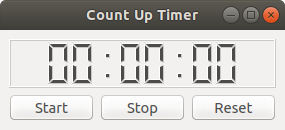

# Count-up timer / Stop watch



Sometimes there is a need for a timer that counts up time instead of counting down time. This is where Count-up timer comes in.

Count-up timer is cross platform written in the [Python](https://www.python.org/) programming language using [Qt](https://www.qt.io/) licensed under the [GPLv3](http://www.gnu.org/licenses/gpl-3.0.html).

## Getting started

Clone the repository

```bash
git clone https://github.com/twigmac/count-up-timer.git
```

Enter the project directory

```bash
cd count-up-timer
```

Run the script

```bash
python CutMainWindow.py
```
